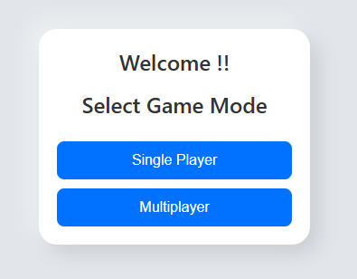
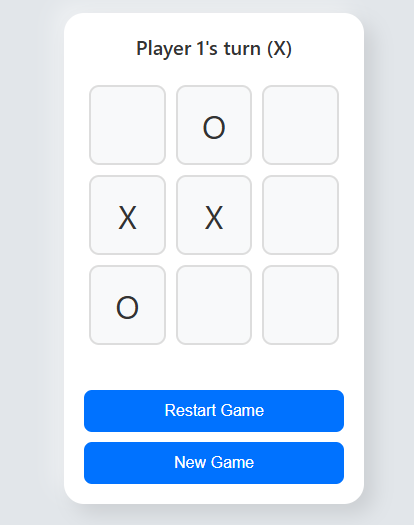
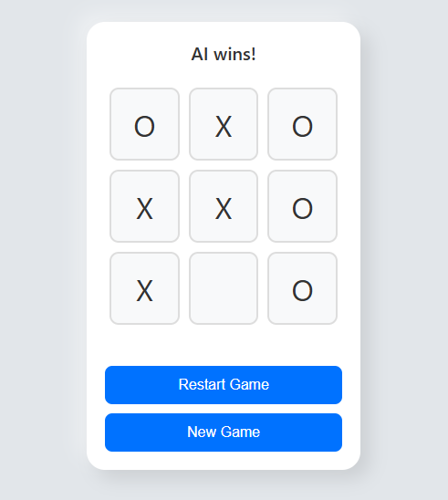

# Tic-Tac-Toe Game

A classic Tic-Tac-Toe game built with HTML, CSS, and JavaScript. The game allows both **single-player** (against AI) and **multiplayer** modes. It includes a user input form for entering player names, dynamic UI updates, and a minimax algorithm for AI decisions.

## Features

- **Single-player**: Play against the AI using the minimax algorithm for optimal moves.
- **Multiplayer**: Play with another person on the same device.
- **Name Input**: Enter custom names for players at the start of the game.
- **Restart Game**: Restart the game at any point with the click of a button.
- **Responsive Design**: Works well on both desktop and mobile devices.

## Screenshots

### Game Screenshots

<div>
   
   
   
</div>

## How to Use

1. Clone this repository or download the ZIP file.
2. Open `index.html` in your browser to start playing.
3. Select the game mode (Single-player or Multiplayer).
4. Enter player names and start the game.
5. Play the game by clicking on the cells to make moves.
6. If you're playing against AI, it will make moves after your turn.

## Setup

1. Clone the repository:
   ```bash
   git clone https://github.com/your-username/tic-tac-toe.git
   
2. Open the index.html file in your browser to start the game.

# Technologies Used
  - HTML5: Structure of the web page.
  - CSS3: Styling of the game layout, including responsive design.
  - JavaScript: Logic for handling game interactions, including AI moves using the minimax algorithm.

# How to Contribute
  1. Fork the repository.
  2. Create a new branch (git checkout -b feature/your-feature).
  3. Commit your changes (git commit -am 'Add new feature').
  4. Push to the branch (git push origin feature/your-feature).
  5. Create a pull request.

# License
This project is licensed under the MIT License - see the LICENSE file for details.
